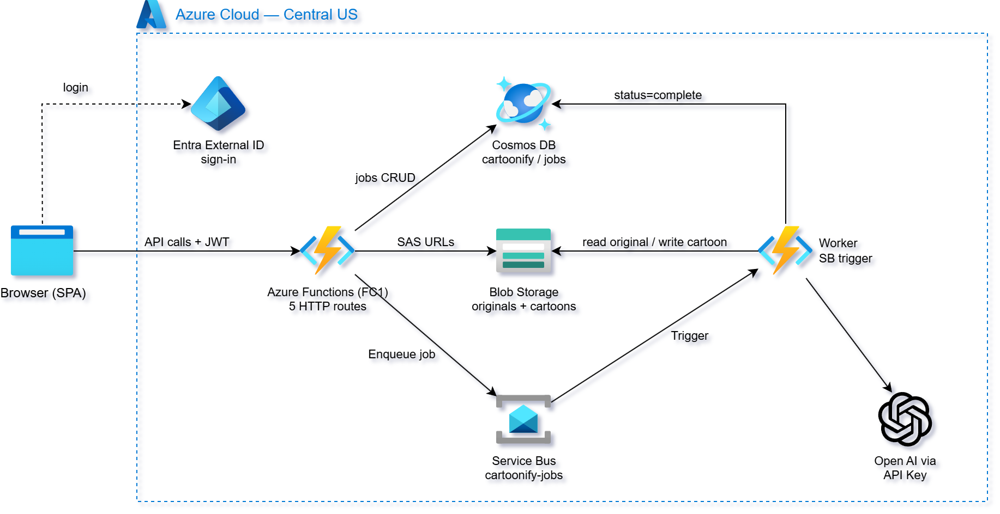
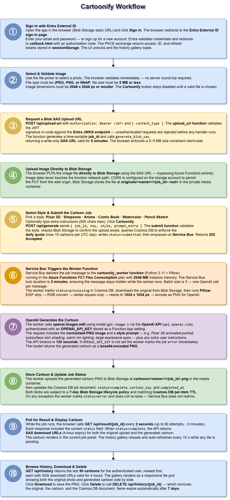
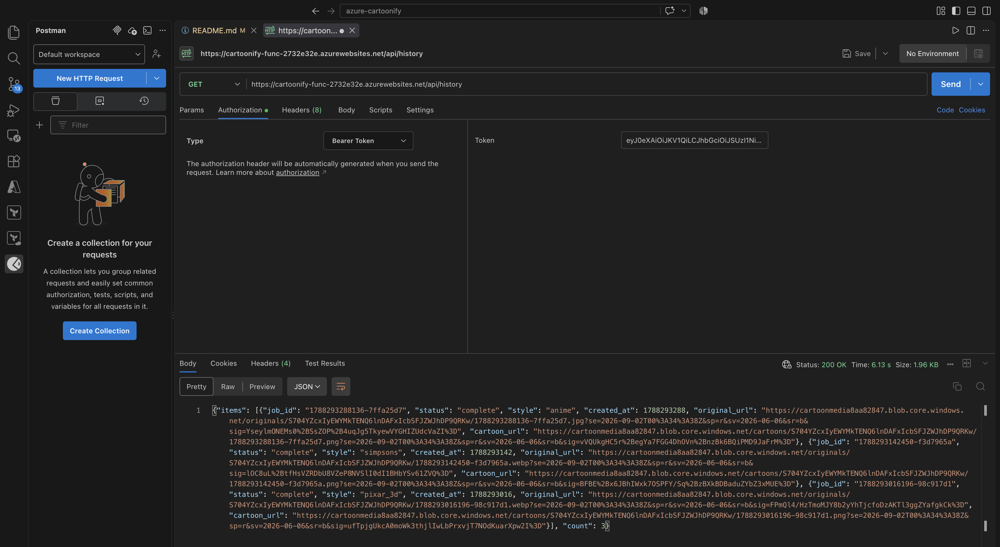
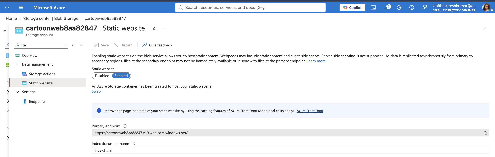
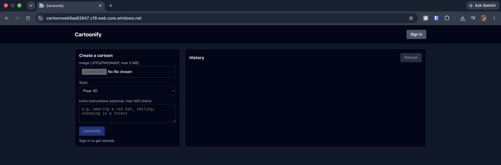
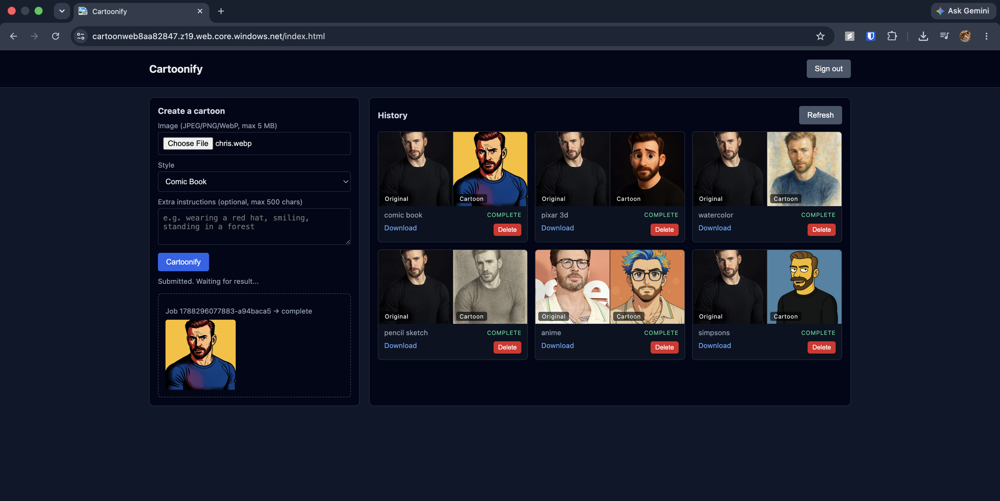
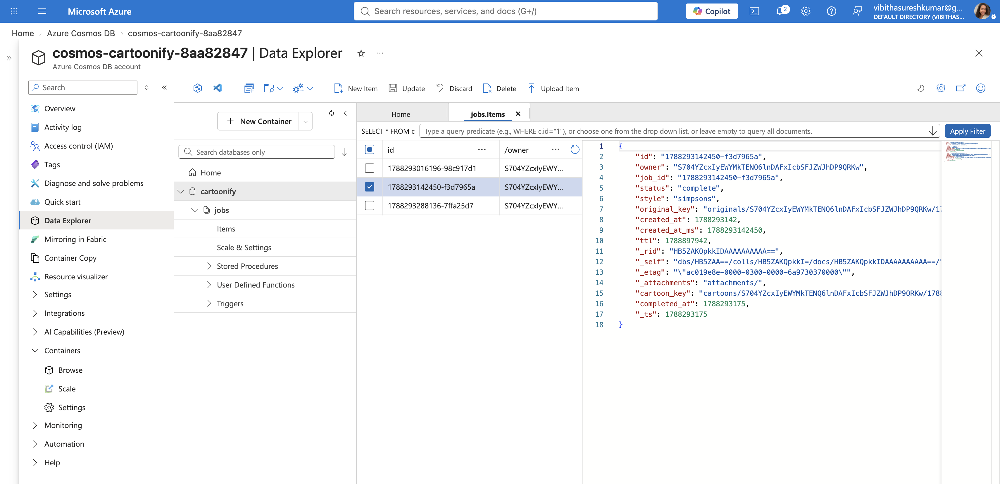

# Cartoonify

> A fully automated serverless image-to-cartoon service built on Azure.


### 📌 Overview
This project is a demonstration of a fully automated, cloud-native, **serverless image-to-cartoon service** built on
Azure by using Azure Functions, Azure Service Bus, Cosmos DB, Azure Blob Storage and Azure Open AI Service.

### 🏗️ Setup Architecture



### 📊 Application Flow


### 🔑 Key Features

1. **Async Job Queue** — Photo upload, job submission, and cartoon generation are
   fully decoupled via Azure Service Bus. The browser polls for completion rather
   than waiting on a long HTTP request.
2. **OpenAI Image Editing** — `gpt-image-1` `images.edit()` takes the uploaded photo
   and a style prompt and returns a cartoonified PNG.
3. **Authenticated API** — All HTTP endpoints require a valid Entra External ID JWT,
   validated against Entra JWKS.
4. **Per-User Data Isolation** — Cosmos DB partition key `/owner` is set from the
   JWT `sub` claim. Users can only read and delete their own jobs.
5. **Blob SAS Tokens** — Direct browser-to-storage upload via write-only SAS URL
   (5 min). Cartoon downloads via read-only SAS URL (4 hours). No API proxying of
   binary data.
6. **Infrastructure as Code** — Terraform provisions all resources in a 3-stage
   deploy.


### ⚙️ How It Works

> Users sign in via **Microsoft Entra External ID**, upload a photo, pick a
 cartoon style, and a **Service Bus–driven worker** calls the **OpenAI API**
 (`gpt-image-1`) to generate a cartoonified version. Results are stored in **Blob
 Storage** and accessed via short-lived SAS URLs.
>
> Technicaly :
 This follows a serverless async pattern — the HTTP API accepts a job and returns immediately, while a Function App worker does the heavy lifting (Pillow for image normalization, OpenAI for generation).


### 🪧 Demonstration
1. Test API locally with postman


2. Static Website and its Primary Endpoint


3. Frontend Landing Page: The initial view of the Static Web App before logging in


4. Workspace after Authentiaction. 


5. Storage Verification (Cosmos DB Container)



### 🚀 API Endpoints


All endpoints require `Authorization: Bearer <id_token>` and return JSON.

| Method | Path | Purpose |
|---|---|---|
| POST | `/api/upload-url` | Get a Blob SAS URL for direct photo upload |
| POST | `/api/generate` | Validate upload, check quota, enqueue job |
| GET | `/api/result/{job_id}` | Poll job status and get SAS download URLs |
| GET | `/api/history` | Newest 50 jobs for the authenticated user |
| DELETE | `/api/history/{job_id}` | Delete job record and associated blobs |

### Cartoon Styles

| Style key | Description |
|---|---|
| `pixar_3d` | Pixar 3D animated portrait |
| `simpsons` | The Simpsons flat cel-shaded |
| `anime` | Japanese anime cel-shading |
| `comic_book` | Marvel comic book illustration |
| `watercolor` | Fine art watercolor portrait |
| `pencil_sketch` | Graphite portrait sketch |

### Job Status Flow

```
submitted → processing → complete
                      ↘ error
```

---

### 📂 Project Structure

```
azure-cartoonify/
├── 01-backend/
│   ├── cosmosdb.tf        Cosmos DB account, database, container, custom role
│   ├── entra.tf           Entra app registration (SPA, PKCE, redirect URI)
│   ├── main.tf            Providers, resource group, random suffix
│   ├── openai.tf          (placeholder — Azure OpenAI not used)
│   ├── outputs.tf         All outputs consumed by 02-functions and 03-webapp
│   ├── servicebus.tf      Service Bus namespace and queue
│   ├── storage.tf         Web + media storage accounts, CORS, lifecycle policy
│   └── variables.tf       Location, Entra variables
├── 02-functions/
│   ├── code/
│   │   ├── function_app.py   5 HTTP routes + Service Bus worker
│   │   ├── requirements.txt
│   │   └── host.json
│   ├── functions.tf       Function App, RBAC assignments
│   ├── main.tf            Providers, data sources
│   ├── outputs.tf         function_app_url
│   └── variables.tf       All inputs from 01-backend outputs
├── 03-webapp/
│   ├── callback.html      PKCE auth code exchange
│   ├── favicon.ico
│   ├── index.html.tmpl    SPA — upload, style picker, gallery, polling
│   ├── main.tf
│   └── storage.tf         Blob upload of SPA assets
├── apply.sh               3-stage deploy orchestrator
├── check_env.sh           Tool + env var validation
├── destroy.sh             Reverse teardown
└── validate.sh            Print API + web URLs
```
---

> Under the Hood: What Ties It All Together?
>
> 1. External Entra Id Setup:
>     Configure an external tenant, create a user flow for sign-up/sign-in, and register the application as a SPA then configure redirect URIs, and expose API permissions.
> 
> 2. OpenAI API Key:
>     Create an OpenAI account, add billing, and generate an API key — required by the worker function to call gpt-image-1 for cartoon generation.
> 3. Populate and export the  following environment variables before running any scripts

```
# Azure service principal — used by Terraform (azurerm provider)
export ARM_CLIENT_ID="<sp-client-id>"
export ARM_CLIENT_SECRET="<sp-client-secret>"
export ARM_TENANT_ID="<arm-tenant-id>"
export ARM_SUBSCRIPTION_ID="<subscription-id>"

# Entra External ID tenant — azuread provider
# apply.sh (Graph API user flow association)
export ENTRA_TENANT_ID="<external-tenant-id>"
export ENTRA_TENANT_NAME="<external-tenant-name>.onmicrosoft.com"
export ENTRA_SP_CLIENT_ID="<entra-sp-client-id>"
export ENTRA_SP_CLIENT_SECRET="<entra-sp-client-secret>"
export ENTRA_USER_FLOW_NAME="<user-flow-display-name>"

# OpenAI — used by the cartoonify worker (gpt-image-1 image generation)
export OPENAI_API_KEY="<openai-api-key>"

```

